  <picture>
    <source media="(prefers-color-scheme: dark)" srcset="https://raw.githubusercontent.com/buzs/buzs/output-3d-contrib/night.svg" />
    <source media="(prefers-color-scheme: light)" srcset="https://raw.githubusercontent.com/buzs/buzs/output-3d-contrib/day.svg" />
    
  </picture>

<h1 align="center">Gabriel Henrique · Buzs ⚗️</h1>

  <strong>Full Stack Developer · UX-minded builder · Homelab enjoyer · Creator tools architect</strong>

  I build products, automations and infrastructure for creators, communities, payments, streaming and weird-but-useful ideas that somehow become real software.

  
  
  

---

## 👋 About me

I'm a Brazilian software engineer who likes turning messy ideas into real systems.

I work across **frontend, backend, infrastructure, automation, product design and creator economy tooling**.  

I care a lot about **developer experience**, **product usability**, **scalable architecture** and **systems that are actually useful for people**.

---

## 🧠 What I usually build

<table>
  <tr>
    <td width="50%">
      <h3>🚀 Products & Platforms</h3>
      

        Dashboards, internal tools, creator platforms, payment flows,
        streaming utilities and SaaS-like systems for real operations.
      

    </td>
    <td width="50%">
      <h3>🤖 Bots & Automation</h3>
      

        Discord, Twitch, WhatsApp, Telegram and multi-channel bot architectures
        with queues, workers and typed APIs.
      

    </td>
  </tr>
  <tr>
    <td width="50%">
      <h3>🧰 Infrastructure</h3>
      

        Docker, Coolify, Proxmox, tunnels, self-hosted services,
        observability experiments and home lab chaos engineering.
      

    </td>
    <td width="50%">
      <h3>🎨 UX & Interfaces</h3>
      

        Clean interfaces, dense dashboards, design systems,
        developer tools and user flows that don't make people cry.
      

    </td>
  </tr>
</table>

---

## ⚙️ Tech stack

### Main stack

  

### Also around here

  

---

## 🏗️ Current focus

- Building tools for **creators, communities and streamers**
- Designing systems around **payments, subscriptions and automation**
- Exploring **AI-assisted workflows**, personal assistants and desktop tools
- Improving self-hosted infrastructure with **Proxmox, Docker, Coolify and observability**
- Creating modular bot architectures for **Discord, Twitch, WhatsApp and Telegram**

---

## 📊 GitHub stats

  
  

  

---

## 🌎 Where to find me

  
  
  

 <em>Building tools, breaking things, fixing them better, and probably running something in Docker at 3AM.</em> 

